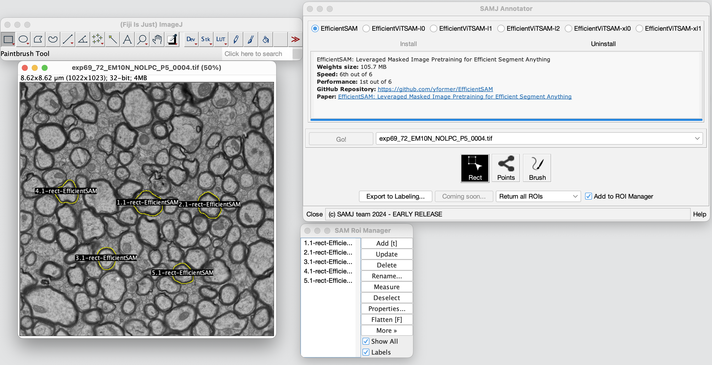

> **Comment:** Just a reminder for the developers that there exists a [branch `no_real_networks_installed`](https://github.com/DeepImageJ-Hackaton/SAMJ-core/tree/no_real_networks_installed), which includes no special dependencies such as `apposed` (Java-Python bridge) or any network itself.

# SAMJ-IJ

The SAMJ-IJ is a powerful Fiji plugin for annotating microscopy images using various versions of the Segment Anything Model (SAM). This README provides detailed instructions on how to use the plugin for image annotation. In this first version of the plugin, the SAMJ-IJ Annotator is delivered to annotate images through the usage of prompts. The plugin is designed to be user-friendly and efficient, allowing for easy and accurate image annotation for further analysis.
Documentation preliminary version. Needs to be reviewed, improved and, of course, to add screenshots of the plugin usage.

## Contents
- [Installation](#installation)
- [Model Installation](#model-installation)
- [Annotating Images](#annotating-images)
- [Saving Annotations](#saving-annotations)
- [Usage Example](#usage-example)
- [Notes](#notes)

## Fiji and Plugin Installation

Before you can annotate images using SAMJ-IJ, you need to install the plugin in Fiji:

1. **Install Fiji**: If you haven't already, download and install [Fiji](https://fiji.sc/).
2. **Install SAMJ Plugin***: Open Fiji and navigate to `Help > Update...`. In the `Manage update sites` window, click on `Add update site` and look for the SAMJ Annotator Plugin. Click `OK` to add the update site. Restart Fiji to apply the changes.
3. **Open SAMJ-IJ Annotator**: Start Fiji and navigate to `Plugins > SAMJ > SAMJ Annotator` to open the plugin.

## Model Installation

To use the SAMJ-IJ plugin, you must install a SAM model:

1. Open the SAMJ Annotator plugin as described above.
2. Choose a SAM model from the list provided within the plugin.
3. Click on the `Install` button next to the selected model.
4. Wait for the installation process to complete. This may take some time depending on the model size, your computer and your internet connection.
> **Comment:** Maybe we could add a section somewhere with more details on how long can take depending on the model and some guideance on which model to choose depending on your comptuer specs.

## Annotating Images

Once you have installed a model, follow these steps to annotate your image:

1. **Open Image**: Open the microscopy image you want to annotate in Fiji.
2. **Select the Image**: In the SAMJ Annotator plugin, ensure your image is selected in the dropdown bar.
3. **Start Annotation**: Click on `Start/Encode` to begin the annotation process.
4. **Choose Annotation Method**: Use one of the following tools to annotate your image:
   - `Rectangle (Rect)`: Draw rectangular regions of interest (ROIs).
   - `Points`: Click to mark points on the image. Hold `Ctrl` to select multiple points for a single object.
   - `Brush`: Paint freeform ROIs.

   Optionally, untick the `Add to ROI Manager` checkbox if you don't want your annotations to be added to the Fiji ROI Manager automatically.
5. **Annotate**: Annotate as many objects as needed. With each ROI drawn using one of the three tools, the installed SAM version will run and the object will be annotated.
6. **Manage Annotations**: All annotations will be sent to the ROI Manager (if the checkbox is ticked), where you can perform various operations as allowed by Fiji's ROI Manager functionality.

## Saving Annotations

To save your annotations:

1. Open the ROI Manager in Fiji.
2. Select the annotations you wish to save.
3. Choose `More > Save` to save the selected annotations as a roi.
4. Choose a location and name for the file and click `Save` to save the annotations as a .roi file.
> **Comment:** Can we use the `Edit > Selection > Create Mask` to save the annotations as a mask? This would be more useful for the user, as the .roi file is not very useful for further analysis.

This functionality allows you to save your annotations for further analysis or documentation purposes.

## Usage Example

> **Comment:** Add some screenshots of the plugin usage when available.

The image shows an example of how objects are annotated within the SAMJ-IJ plugin. Each annotated object is clearly marked and labeled, indicating the ease and efficiency of the plugin's use for image analysis.

## Notes

- This plugin is intended for use with microscopy images.
- The documentation here is for users only. Developer documentation, including contribution guidelines, will be available in a separate repository.

For further assistance or to report issues, please visit the [plugin's repository](https://github.com/segment-anything-models-java/SAMJ-IJ).

Thank you for using the SAMJ-IJ Fiji plugin!
